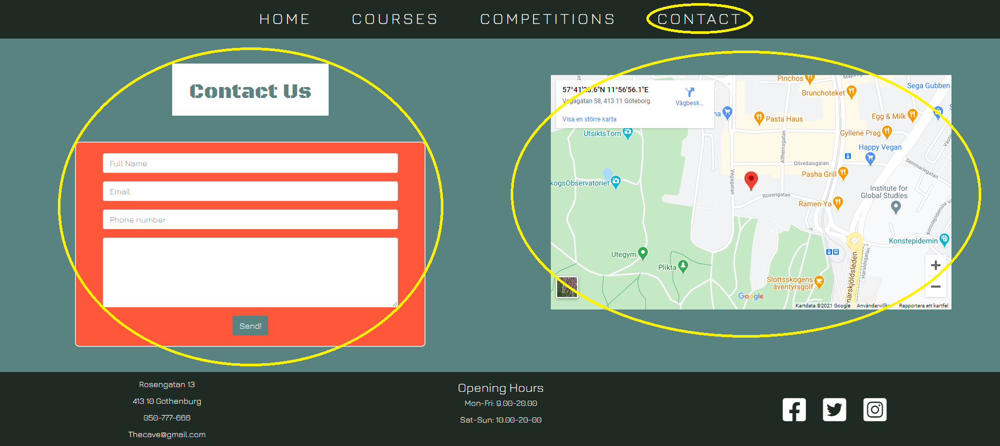
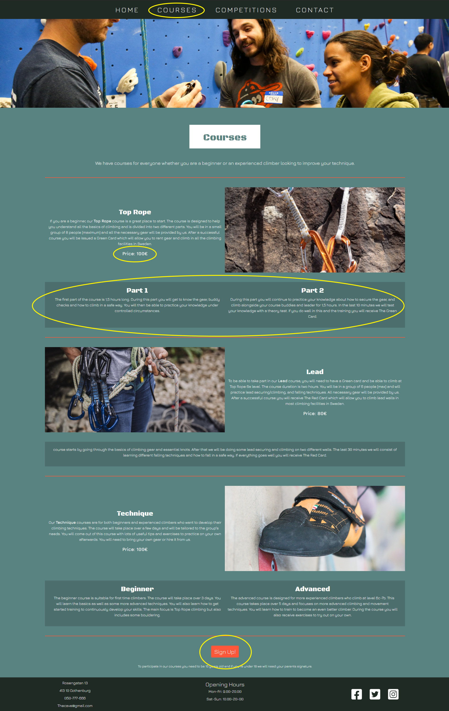
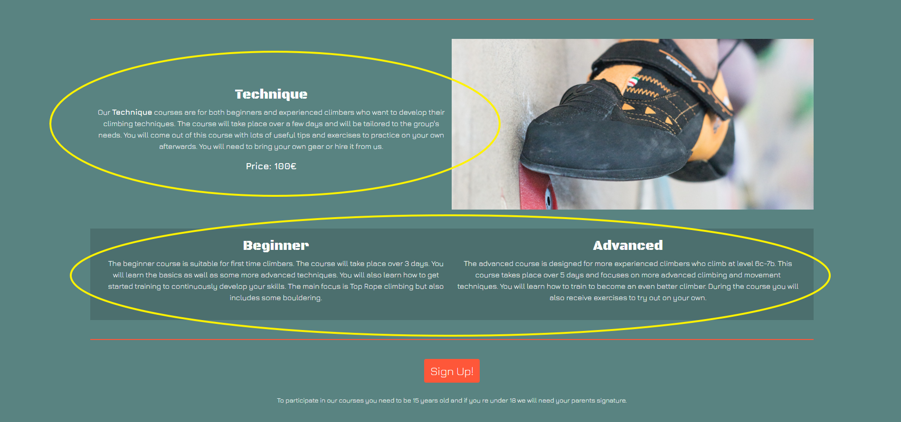

# The Cave Climbing Gym

Link to [The Cave Climbing Gym](https://martinfjellstrom.github.io/MS1-the-cave/)
 site

This is the site for a climbing gym based in Gothenburg, Sweden. It is designed to give customers a place to find information about the gym, its facilities and services, as well as its location and contact details. 

(mock up on different devices)

# UX

## User Stories

#### As a first time visitor and potential gym member I want:

* To find out about the climbing gym, its facilities, and its staff.

* To easily find useful information such as prices, opening hours and location.

* To find detailed information regarding available climbing courses and be able to easily book online. 

* To easily find social media links so that I can learn more about the gym’s reputation and opinions from frequent visitors to get an idea of how good they are. 

#### As a returning visitor I want:

* To be able to easily contact the gym with any questions I may have. 

* To be able to get information about membership options so that I can choose what works best for me. 

#### As a frequent visitor or gym member I want:

* To find information about upcoming events and competitions at the gym.

* To find out the results of the previous climbing competitions hosted at the gym.

* To find information on courses to improve my technique, and be able to easily book online. 

## Design

### Colour scheme

#### The main colours used throughout the site are:
      
Tomato rgb(254,87,57)        (IMG)

Darkslaegrey rgb(32, 42, 37)    (IMG)

Slategrey rgb(89, 131, 129)     (IMG)
      
### Fonts

The main fonts used throughout the site are [Jura](https://fonts.google.com/?query=jura) and [Black Ops One](https://fonts.google.com/?query=black+ops+one) with Serif 
as a fallback font should the font not be supported by the user’s browser. The fonts were chosen to give an alternative, sporty and modern feel which is pleasing to the users and potential customers of the climbing gym. 

### Imagery

There are hero images on most of the site pages in order to grab user’s attention and give a sporty feel to the site overall. On the home page the image carousel is there to give users an idea of what the gym looks like. Pictures are included throughout to give a modern and colourful vibe. 

## Wireframes

[Wireframes PDF](assets/Readme/MS1-wireframes.pdf)

# Features

## Existing Features

* **Responsiveness on all device sizes** – allows users to access the site from any device

* **Sign up button on courses page** – opens a modal with the booking form to allow users to book a course.

* **Course booking form** - allows users to easily book a course.

* **Contact form** – allows users to easily get in contact with the gym. 

* **Pop-up message on submission of contact form** – thanks users for their message, adding a friendly touch to the experience. 

* **Social Media links** – allows users to further engage with the community and  follow all current events as well as review the gym. 

* **Navigation bar throughout** – allows users to navigate easily to all pages

* **Image carousel** – shows the user pictures of the gym and what it looks like

* **Map** – allows users to easily find the location of the gym.

* **Internal link from competitions page to contact page** – gives users another way to easily access the contact page. 

* **Collapse buttons on competitions page** – allows users to toggle view of previous competition results.

* **Hamburger menu in mobile version** – allows users to easily access the navigation links in a more compact, user friendly way.

## Features left to implement

* Sign up button and form on competitions page to allow users to easily sign up to competitions

# Technologies Used 

## Languages Used

* [HTML5](https://en.wikipedia.org/wiki/HTML5)
* [CSS3](https://en.wikipedia.org/wiki/CSS)

## Frameworks, Libraries & Programs Used

* [Bootstrap 5](https://getbootstrap.com/docs/5.0/getting-started/download/) – used to help the responsiveness, layout and styling of the website as well as for the creation of modals, image carousel navigation bar
* [Google fonts](https://fonts.google.com/) – used to import fonts into the style.css file
* [Font Awesome](https://fontawesome.com/) – used to import icons for the social media links, hamburger menu and previous competition buttons
* [GitHub](https://github.com/) – used to store the projects code after being pushed from Git.
* [GitPod](https://gitpod.io/) – used to edit the projects code before committing it to Git.
* [Git](https://git-scm.com/) – used for version control of the code
* [Balsamiq](https://balsamiq.com/) – used to create the mobile and desktop wireframes
* [W3 Jigsaw](https://jigsaw.w3.org/css-validator/) – used to validate the CSS code
* [W3C validator](https://validator.w3.org/) – used to validate the HTML code
* [Chrome DevTools](https://developers.google.com/web/tools/chrome-devtools) – used to debug and test code
* [PicPick](https://picpick.app/) – used to screen capture pages for use in the README file
* [Eye Dropper](https://chrome.google.com/webstore/detail/eye-dropper/hmdcmlfkchdmnmnmheododdhjedfccka) – Used to get colour from picture 

# Testing

## Code Validation
For testing W3C Markup Validation Service was used to validate the HTML code and W3C CSS Validation Service was used to validate the CSS code. 

### **HTML**

There were no errors found in the HTML code

[HTML validator results](https://validator.w3.org/nu/?doc=https%3A%2F%2Fmartinfjellstrom.github.io%2FMS1-the-cave%2F)

### **CSS**

There were errors found in the CSS code, however these were part of the bootstrap code.

[CSS validator results](https://jigsaw.w3.org/css-validator/validator?uri=https%3A%2F%2Fmartinfjellstrom.github.io%2FMS1-the-cave%2F&profile=css3svg&usermedium=all&warning=1&vextwarning=&lang=sv)

## Testing User Stories

### As a first time visitor I want:

#### To find out about the climbing gym, its facilities, and its staff.

* On the landing page of the site the user is immediately greeted by a hero image of people climbing an indoor boulder wall. This gives the user an idea of what the site is about. 
      
* On the landing page there is a short introduction of the gym consisting of a Welcome message followed by an About Us paragraph. This section mentions the location of the gym, the types of climbing walls that are available as well as their size. This gives the user a nice greeting as well as some key information about the gym’s facilities.
      
* There is a link in the navigation bar to the Contact Us page where users can get in touch with the gym or see a map of the location.

* The carousel on the landing page allows the user to browse through images of the climbing gym so that they can see what the different walls look like.

* There is a section called “The Team” on the landing page which gives the user some information about the gym’s climbing instructors. 

#### To easily find useful information such as prices, opening hours and location.

* At the bottom of the landing page there is a “Prices” section where the user can find entry fee, gear rental and membership fee information.
       
* The opening hours and address are found in the footer on all pages so the user can easily find them.

* The user can access the “Contact” link in the navigation bar on all pages.

* On the contact page the user can get in touch with the gym directly by completing the contact form. 

* There is a google map embedded on the contact page which allows the user to find the location of the gym. The user can also open the map in Google directly from the map and get directions. 

#### To find detailed information regarding available climbing courses and be able to easily book online. 

* The user can access the “Courses” link in the navigation bar on all pages.

* On the courses page the user can find detailed descriptions of all the available courses.

* Prices are displayed clearly on the courses page under the descriptions to allow the user to easily see this information before booking.

* On the courses page the user can easily book courses online using the “Sign Up” button and submitting the booking form.
      

Course booking form:

#### To easily find social media links so that I can learn more about the gym’s reputation and opinions from frequent visitors to get an idea of how good they are. 

* There are social media links in the footer of all pages so the user can easily find and access them. The placement of the links in the footer is common in most websites so this is user-friendly.

### As a returning visitor I want:

#### To be able to easily contact the gym with any questions I may have. 

* On the contact page the user can get in touch with the gym directly by completing the contact form. 
      
* The phone number and email address is found in the footer on all pages so the user can easily find them.
      
* The user can access the “Contact” link in the navigation bar on all pages.

#### To be able to get information about membership options so that I can choose what works best for me. 

* On the home page there is a prices section where the user can easily find all the available membership options without needing to navigate to any other pages. 

### As a frequent visitor or gym member I want:

#### To find information about upcoming events and climbing competitions at the gym.

* Users can access the “Competitions” link in the navigation on all pages
      
* On the competitions page there is detailed information regarding climbing competitions. This includes dates for upcoming competitions.
       
* There are social media links in the footers of all pages so that users can easily access them. Users may use these links to follow the gym on social media and see further information about upcoming events at the gym. 
      
* There is a link to the contact page in the navigation bar as well as in the information section on the competition page for users to get in touch with any questions or enquiries. 

#### To find out the results of the previous climbing competitions hosted at the gym.

* On the competitions page users can easily find the results of previous competitions in the “Previous Competition Winners” section by toggling the collapse buttons as required.

#### To find detailed information on courses to improve my technique, and be able to easily book online. 

* On the courses page users can easily find all necessary information regarding available courses. 

* Prices are presented clearly on the courses page below information for each course. Prices can also be found in the course booking form so that there is more than one place the user can see them. 

* The information on the courses page includes details about the levels required to take part so that users can choose courses that are right for their level. 

* On the courses page users can find a “technique” course for beginners as well as advanced climbers to improve their technique.

* On the courses page the user can easily book courses online using the “Sign Up” button and submitting the booking form.

## Compatibility Testing

### The site was tested in the following browsers:

* [Firefox](https://www.mozilla.org/)

* [Edge](https://www.microsoft.com/edge)

* [Opera](https://www.opera.com/)

* [Chrome](https://www.google.se/chrome/)

### [Am I Responsive](http://ami.responsivedesign.is/) was used to test responsiveness on the following devices:

* **Desktop** 1600x992px

* **Laptop** 1280x802px

* **Tablet** 768x1024px

* **Mobile** 320x480px

## Bugs

1. On Firefox browser the items in the dropdown options in the course booking form do not show in the correct font (Jura)

    **Fix:** I wrote a Mozilla specific extension in the css file that targeted the options in the dropdown menu

        @-moz-document url-prefix() {
        .form-select option {
        font-family: 'jura', serif;
        }
        }

2. On Firefox browser the table in the “Entry Fee” card in the “Prices” section of the landing page is centred rather than aligned to the top of the card.

    **Fix:** I wrote a Mozilla specific extension in the css file that targeted the .entry-fee-table and gave it a top margin.

        @-moz-document url-prefix() {
        .entry-fee-table {
        margin-top: 10px;
        }
        }

3. On a mobile device (320x480px) the boxed headings (competitions, the team, courses) push the size of screen out more than other content on the page, creating a white gap on the right side of all pages.

    **Fix:** I removed the side paddings on the .who-we-are selector in the css file which pushed the "The Team" boxed heading to the right.

        .who-we-are {
        padding: 50px 0px;
        background-color: rgb(89, 131, 129);
        }

    I took the course boxed heading out of the course-text div which has a specified width that pushed the box to the right

    I took the competition boxed heading out of the about-comp div which has a specified width that pushed the box to the right

4. On a mobile device (320x480px) “The Cave” heading on the landing page is overlapping the navigation bar.

    **Fix:** I wrote a media query for max-height and changed the font size to 5rem so the heading doesn't overlapp the navbar

        @media (max-height: 550px) {
        .welcome-text {
        font-size: 5rem;
        }
        }

5. On tablet device one one of the collapse buttons on the competitions page is a different height to the others.

    **Fix:** I added some extra space inbetween the text and the icon on the buttons

        Top Rope Competition 02/10/2020 &nbsp;&nbsp;&nbsp;<i class="fas fa-arrow-down"></i>

6. On all devices there is a white gap on the right side of the landing page.

    **Fix:** Inspected the applied CSS in dev tools and toggled the values in the rules view, unchecking the checkboxes to find which property caused the bug. Found a bootstrap property was the cause of the bug and consequently set the value to 0 which fixed it.

        .row {
        --bs-gutter-x: 0rem;
        }

# Deployment

## GitHub Pages

### The project was deployed to GitHub pages using the following steps:

1. Login to Github

2. Locate and select the “MartinFjellstrom/MS1-the-cave” repository.

3. On the top tab, locate and select "Settings".

4. Scroll down to find the "GitHub Pages" section.

5. Under source, select the "Master" branch from the dropdown selection menu.

6. A second dropdown appears next to the branch dropdown. Make sure that "/(root)" is selected.

7. Press the "Save" button and the page will automatically refresh.

8. Scroll back down to the "GitHub Pages" section and find the now published link to the deployed site in the coloured section under the GitHub Pages heading. 

## Making a local Clone

1. Log in to GitHub and locate the “MartinFjellstrom/MS1-the-cave” repository
2. Click on the “Code” dropdown next to the green “GitPod” button.
3. Under Clone, select the "HTTPS" option
4. Copy the URL shown
5. Open your local IDE and then open the terminal
6. Change the current working directory to the location where you want the cloned directory.
7. Type "git clone" in the terminal and then paste the URL you previously copied.

        $ git clone https://github.com/YOUR-USERNAME/YOUR-REPOSITORY

8. Press Enter to create your local clone repository.

        $ git clone https://github.com/YOUR-USERNAME/YOUR-REPOSITORY
        > Cloning into `CI-Clone`...
        > remote: Counting objects: 10, done.
        > remote: Compressing objects: 100% (8/8), done.
        > remove: Total 10 (delta 1), reused 10 (delta 1)
        > Unpacking objects: 100% (10/10), done.

# Credits

All content on the site was written by myself and proof-read by Melissa De Siena.

## Media

### Images

#### Hero Images:

* Landing Page - http://www.boulderingstockholm.se/

* Courses Page - https://www.paradoxsports.org/calendar/aci-rcf2020/

* Competitions Page - https://lic.thecliffsclimbing.com/events

#### Landing Page Carousel:

* www.pikist.com

* www.piqsels.com

* www.publicdomainpictures.net

#### "The Team" Images:

* www.piqsels.com

* www.pickpik.com

#### Courses Page:

* Top Rope Course - https://climbcore.wordpress.com/2015/04/19/tried-and-true-anchors-for-setting-up-top-ropes/

* Technique Course - https://rockandice.com/how-to-climb/rock-climbing-technique/

* Lead Course - https://www.rei.com/learn/expert-advice/quickdraws.html

## Code 

**Navigation bar** - For the creation of the navigation bar I was inspired by “Bootstrapping Your Next Big Idea With Bootstrap 4 - Components - Core Components - part 1” Code Institute lesson.

[Bootstrap V.5](https://getbootstrap.com/) Template code from the Bootstrap documentation was used 
to create the navbar, cards, modals, tables, collapse buttons and the carousel.

[Google Maps](https://developers.google.com/maps/documentation/embed/get-started) – Used for the embedded map on the contact page.

# Acknowledgements

A big thank you to my partner Melissa for her support throughout this project.

Thanks to my mentor for his help and input on how to improve the site.

Thanks to the tutors at Code Institute and Student Care service for their support.

